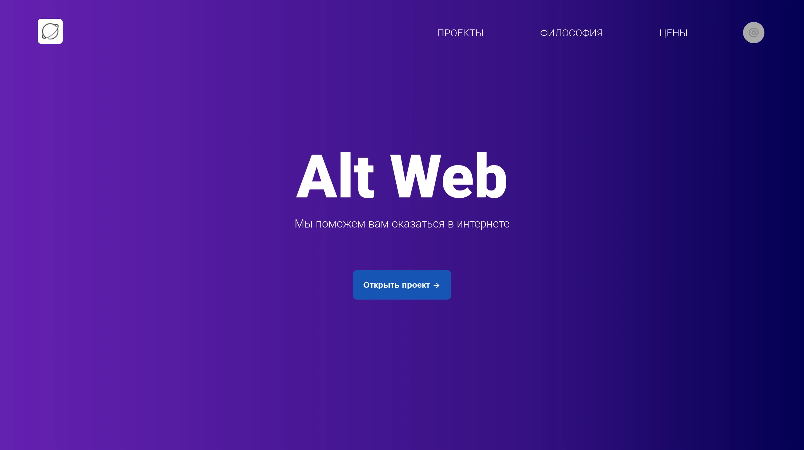

# Alt Web



## Development server

```bash
podman-compose up --build
```

Open [http://localhost:3000](http://localhost:3000) with your browser to see the result.

## Build project:

```bash
podman build -f docker/prod.Dockerfile .
```

## Podman

In our examples, we use podman, but you can safely replace it with docker.
However, you may need to add `sudo` before the command.
